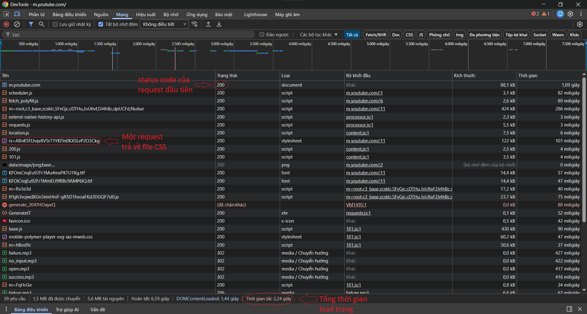
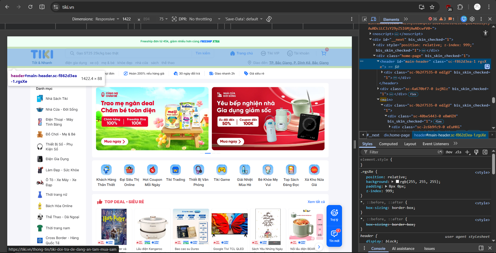
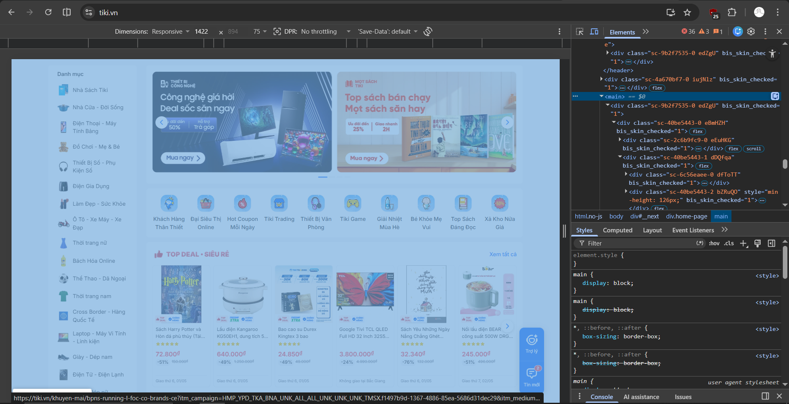
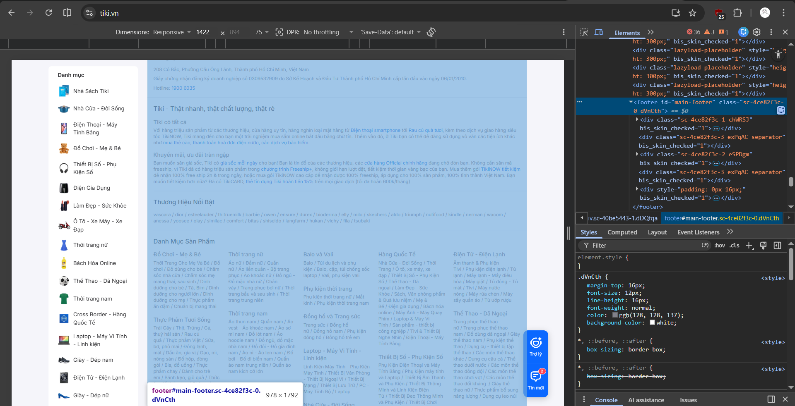
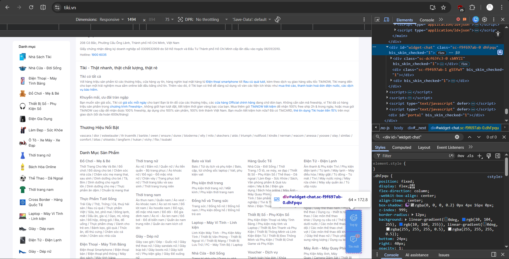
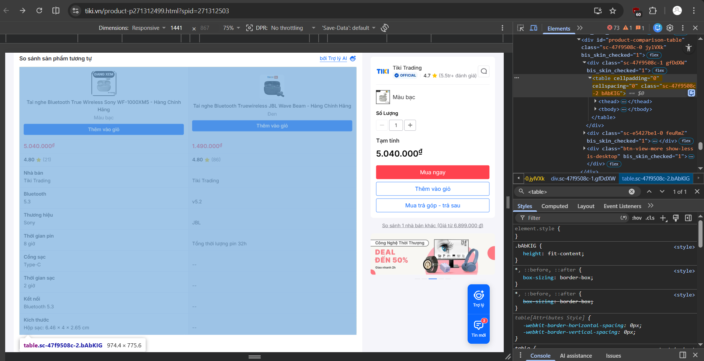
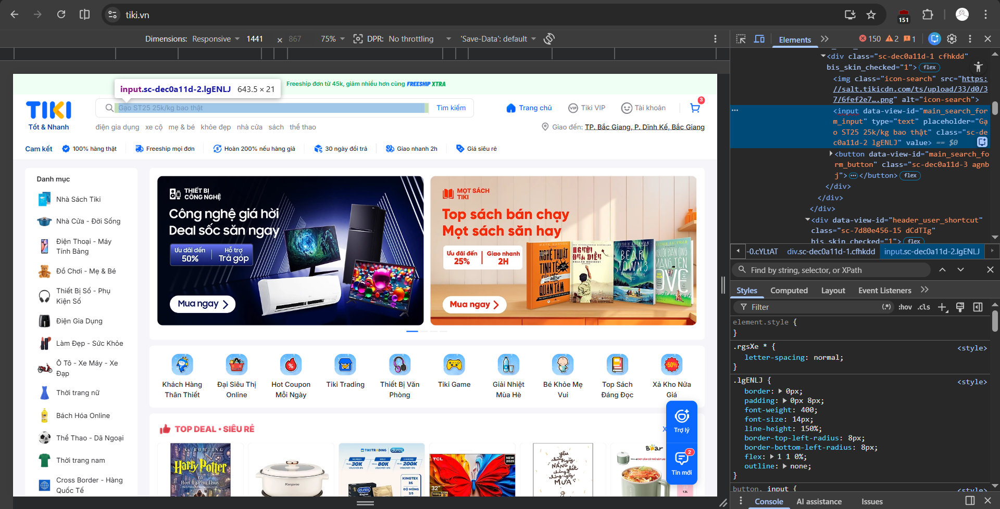

Câu A1:
1. Các bước xảy ra khi bạn gõ https://shopee.vn vào trình duyệt và nhấn Enter dựa vào chương 01 (01_introduction_html_universe.md):
- Request xuất phát từ thiết bị (laptop/trình duyệt) đi qua router WiFi.
- Tín hiệu đi qua nhà mạng cung cấp dịch vụ Internet (VD: VNPT) và truyền qua hệ thống cáp quang.
- Request đến được data center của máy chủ (Server).
- Server tiếp nhận và xử lý yêu cầu (Ví dụ: truy xuất cơ sở dữ liệu để lấy thông tin trang).
- Server gửi Response chạy ngược lại đường cũ (cáp quang → nhà mạng → router → laptop).
- Trình duyệt (Chrome) nhận các file HTML, CSS, JS, tiến hành render và hiển thị giao diện lên màn hình.
Tài liệu: tuan_1_html5/01_introduction_html_universe.md - phần 1.Web hoạt động như thế nào?
2. 

Tài liệu: tuan_1_html5/01_introduction_html_universe.md - phần 4.3 Developer Tools (F12) — "Kính hiển vi" cho website

Câu A2:
- Theo chuơng 04, trang web bị Google đánh giá SEO thấp vì sử dụng tình trạng "Div Soup" (chỉ dùng thẻ 
 cho mọi thứ), khiến Google Bot và các công cụ hỗ trợ đọc (Screen Reader) không thể hiểu được cấu trúc và ý nghĩa của từng phần nội dung.
- Các lỗi semantic và cách sửa:
+ Lỗi 1: Dùng 
 thay vì thẻ định nghĩa phần đầu trang. -> Sửa thành <header>.
+ Lỗi 2: Dùng 
 thay vì thẻ định nghĩa điều hướng. -> Sửa thành <nav>.
+ Lỗi 3: Dùng 
 thay vì thẻ định nghĩa nội dung chính. -> Sửa thành <main>.
+ Lỗi 4: Dùng 
 cho một nội dung độc lập (sản phẩm) thay vì thẻ bài viết độc lập. -> Sửa thành <article>.
+ Lỗi 5: Dùng 
 thay vì thẻ định nghĩa phần cuối trang. -> Sửa thành <footer>.
Tài liệu: tuan_1_html5/04_visible_part_html.md

Câu A3:
- Mô tả bằng text art kết quả hiển thị của đoạn HTML:
Hộp 1
Text A Text B
Hộp 2
Text C Text D
Hộp 3
- Giải thích:
+ Thẻ 
 là Block element, đặc tính của nó là chiếm CẢ DÒNG và tự động xuống dòng mới. Do đó, "Hộp 1", "Hộp 2", và "Hộp 3" sẽ đứng một mình trên các dòng riêng biệt.
+ Thẻ  và <strong> là Inline elements, đặc tính của chúng là chỉ chiếm khoảng không gian vừa đủ cho NỘI DUNG và nằm cùng dòng với nhau. Vì vậy, "Text A" và "Text B" sẽ nằm cạnh nhau trên một dòng; tương tự, "Text C" và "Text D" cũng sẽ nằm cạnh nhau trên một dòng.
Tài liệu: tuan_1_html5/02_basic_structure_html.md

Câu A4:
- Sự khác nhau giữa <thead>, <tbody>, <tfoot>:
+ <thead>: Định nghĩa phần Header (Tiêu đề cột) của bảng.
+ <tbody>: Định nghĩa phần Body (Dữ liệu chính) của bảng.
+ <tfoot>: Định nghĩa phần Footer (Tổng kết) của bảng.
- 3 lý do KHÔNG NÊN dùng table để tạo layout trang web:
+ Bảng (<table>) theo quy tắc chỉ được sử dụng để trình bày dữ liệu dạng bảng (DATA tabular) như danh sách, so sánh, thống kê. Sử dụng sai mục đích là vi phạm nguyên tắc Semantic HTML.
+ Bảng không linh hoạt và rất khó để thiết kế Responsive (thích ứng trên các thiết bị di động), trong khi các công cụ hiện đại như CSS Grid hay Flexbox được sinh ra chính xác cho mục đích layout.
+ Việc dùng bảng làm layout tạo ra cấu trúc DOM rất phức tạp và lồng nhau sâu, gây khó khăn cho việc bảo trì code và làm giảm khả năng đọc hiểu của các công cụ tìm kiếm (SEO) cũng như các thiết bị hỗ trợ người khuyết tật.
Tài liệu: tuan_1_html5/05_tables_hyperlinks.md

Câu B3:
Các lỗi có trong file HTML:
- Lỗi 1: Dòng 1 — Thiếu khai báo chuẩn HTML5 — Cách sửa: Đổi <!DOCTYPE> thành <!DOCTYPE html>.
- Lỗi 2: Dòng 2 — Thẻ <html> thiếu thuộc tính ngôn ngữ (ảnh hưởng SEO và Accessibility) — Cách sửa: Đổi <html> thành <html lang="vi">
- Lỗi 3: Dòng 4 — Thẻ <title> chưa được đóng — Cách sửa: Thêm thẻ </title> vào cuối dòng.
- Lỗi 4: Dòng 5 — Thuộc tính charset viết sai giá trị chuẩn — Cách sửa: Đổi <meta charset="utf8"> thành <meta charset="UTF-8">.
- Lỗi 5: Dòng 8 — Thẻ <h1> đóng sai cú pháp và đặt ngoài thẻ <header> (Lỗi Semantic) — Cách sửa: Sửa <h1>...<h1> thành <h1>...</h1> và di chuyển toàn bộ dòng này vào bên trong thẻ <header>.
- Lỗi 6: Dòng 12 — Thẻ <a> đóng sai cú pháp — Cách sửa: Đổi thẻ <a> ở cuối thành </a>.
- Lỗi 7: Dòng 19 & 26 — Nhảy cấp thẻ Heading từ <h1> xuống thẳng <h3> (Lỗi Semantic) — Cách sửa: Đổi <h3> thành <h2> để đảm bảo hệ thống phân cấp chuẩn.
- Lỗi 8: Dòng 20 — Thẻ  thiếu dấu ngoặc kép ở thuộc tính src và thiếu thuộc tính bắt buộc alt — Cách sửa: Sửa thành .
- Lỗi 9: Dòng 22 — Lồng thẻ sai quy tắc (Nesting error) và dùng thẻ <b> không mang tính Semantic — Cách sửa: Sửa 
Giá: <b>25.990.000đ
</b> thành 
Giá: <strong>25.990.000đ</strong>
.
- Lỗi 10: Dòng 29 & 30 — Khai báo tiêu đề bảng nhưng dùng thẻ <td> thay vì <th> và không bọc trong <thead> — Cách sửa: Đổi <td> thành <th> và bọc khối hàng đó trong <thead >, đồng thời bọc phần dữ liệu phía dưới trong <tbody>.
- Lỗi 11: Dòng 40 — Một trang web không được có 2 thẻ <main> và dùng sai Semantic cho Sidebar — Cách sửa: Đổi thẻ <main> thứ hai thành <aside>.
- Lỗi 12: Dòng 45 — Thẻ 
 chưa được đóng — Cách sửa: Thêm 
 vào cuối câu.
- Lỗi 13: Dòng 47 (Cuối file) — Thiếu thẻ đóng bao quát toàn bộ tài liệu — Cách sửa: Thêm </html> ở dòng cuối cùng sau </body>.

Câu B4:
1. 
- 3 thẻ semantic HTML5 mà tiki.vn sử dụnng:
+ <header id="main-header" class="sc-f862d3ea-1 rgsXe">: Nằm ở đầu trang, dùng để chứa logo, thanh tìm kiếm và các công cụ điều hướng chính.

+ <main>...</main>: Nằm ngay dưới header, dùng để bao bọc toàn bộ khối nội dung chính yếu của trang web.

+ <footer id="main-footer" class="sc-4ce82f3c-0 dVnCth">: Nằm ở dưới cùng của trang, dùng để chứa các thông tin như bản quyền, chính sách, danh mục và các liên kết phụ trợ.

- 2 thẻ không dùng đúng semantic:
+ 
: Đây là khối chat hiển thị nổi ở góc màn hình (nội dung phụ trợ). Theo chuẩn Semantic HTML5, khối này nên được bọc bằng thẻ `<aside>` thay vì dùng `
` vô danh.

2. 
- Table này hiển thị nội dung so sánh giữa sản phẩm hiện tại và sản phẩm khác tương tự được gợi ý bỏi trợ lý AI của web.
- Table này có sử dụng <thead>, <tbody>.

3. 
Trang Tiki không sử dụng thẻ <form> chuẩn semantic cho ô tìm kiếm

Câu C1:
<!DOCTYPE html>
<html lang="vi">
<head>
  <meta charset="UTF-8"> <!-- bảng mã -->
  <meta name="viewport" content="width=device-width, initial-scale=1.0"> <!-- responsive -->
  <title>Product Detail</title>
</head>
<body>

  <!-- HEADER + NAVIGATION -->
  <header>
    <nav> <!-- điều hướng chính -->
      <ul>
        <li><a href="#">Trang chủ</a></li>
        <li><a href="#">Danh mục</a></li>
      </ul>
    </nav>
  </header>

  <!-- BREADCRUMB -->
  <nav aria-label="breadcrumb">
    <ol> <!-- breadcrumb có thứ tự -->
      <li><a href="#">Trang chủ</a></li>
      <li><a href="#">Điện thoại</a></li>
      <li>iPhone 16</li>
    </ol>
  </nav>

  <!-- MAIN CONTENT -->
  <main>

    <!-- WRAPPER: chứa section chính và sidebar cùng cấp -->
    

      <!-- SECTION: ảnh + thông tin sản phẩm -->
      <section>

        <!-- ARTICLE: ảnh sản phẩm -->
        <article>
          <figure> <!-- nhóm ảnh chính -->
            
            <figcaption>Ảnh sản phẩm</figcaption>
          </figure>

          <!-- danh sách ảnh phụ -->
          

            
            
            
            
            
          

        </article>

        <!-- ARTICLE: thông tin sản phẩm -->
        <article>
          <h1>Tên sản phẩm</h1>
          
Giá

          
Đánh giá sao

          
Mô tả

        </article>

      </section>

      <!-- SIDEBAR: cùng cấp với section -->
      <aside> <!-- nội dung phụ -->
        <h2>Sản phẩm tương tự</h2>
        <ul>
          <li><a href="#">SP 1</a></li>
        </ul>
      </aside>

    

    <!-- SECTION: bảng thông số -->
    <section>
      <h2>Thông số kỹ thuật</h2>
      <table>
        <tr>
          <th>Thuộc tính</th>
          <th>Giá trị</th>
        </tr>
        <tr>
          <td>...</td>
          <td>...</td>
        </tr>
      </table>
    </section>

    <!-- SECTION: đánh giá / bình luận -->
    <section>
      <h2>Đánh giá</h2>

      <!-- form nhập -->
      <form>
        <textarea></textarea>
        <button type="submit">Gửi</button>
      </form>

      <!-- danh sách bình luận -->
      

        <article>
          
Tên

          
Nội dung

        </article>
      

    </section>

    <!-- SIDEBAR -->
    <aside> <!-- nội dung phụ -->
      <h2>Sản phẩm tương tự</h2>
      <ul>
        <li><a href="#">SP 1</a></li>
      </ul>
    </aside>

  </main>

  <!-- FOOTER -->
  <footer>
    
Footer

  </footer>

</body>
</html>

Câu C2:
Quan điểm "chỉ cần dùng thẻ 
 và thêm class cho mọi thứ" (hay còn gọi là Div Soup) là một thói quen lập trình lỗi thời và gây hại nghiêm trọng đến chất lượng của website hiện đại.

Về mặt kỹ thuật, việc sử dụng Semantic HTML mang lại hai lợi ích sống còn:
- Thứ nhất là về SEO (Tối ưu hóa công cụ tìm kiếm): Các con bot của Google không "nhìn" thấy giao diện web như con người mà chúng đọc cấu trúc thẻ. Khi bạn dùng các thẻ có ý nghĩa rõ ràng như <header>, <main>, <article>, Google ngay lập tức phân biệt được đâu là nội dung cốt lõi của bài viết và đâu chỉ là thanh điều hướng. Nếu trang web chỉ toàn thẻ 
, công cụ tìm kiếm sẽ không hiểu được ngữ cảnh, dẫn đến việc trang bị đánh giá thấp về SEO. 
- Thứ hai là về Accessibility (Khả năng tiếp cận): Những người khiếm thị sử dụng Screen Reader để duyệt web; các phần mềm này dựa vào cấu trúc thẻ semantic để giúp người dùng "nhảy" thẳng đến nội dung chính (<main>) hoặc bỏ qua phần menu (<nav>). Việc chỉ dùng 
 khiến người khiếm thị hoàn toàn mất phương hướng và không biết mình đang ở đâu trên trang.

Ví dụ cụ thể: Hãy tưởng tượng một website tin tức. Thay vì viết 
, việc dùng thẳng thẻ <article> sẽ khai báo rõ ràng với trình duyệt và các ứng dụng đọc báo (Reader View) rằng khối nội dung này là một bài báo độc lập, có thể tách rời để hiển thị trọn vẹn.

Tuy nhiên, thẻ 
 không hoàn toàn vô dụng. Trường hợp thực tế phù hợp để dùng 
: Thẻ 
 được thiết kế làm một "hộp không tên". Nó nên được sử dụng khi bạn cần một vùng chứa (wrapper/container) thuần túy để nhóm các phần tử lại với nhau nhằm phục vụ cho việc tạo layout CSS (ví dụ: bọc 3 thẻ <article> vào một 
 để dùng CSS Grid) mà không làm thay đổi hay thêm bớt ý nghĩa ngữ nghĩa của nội dung bên trong.